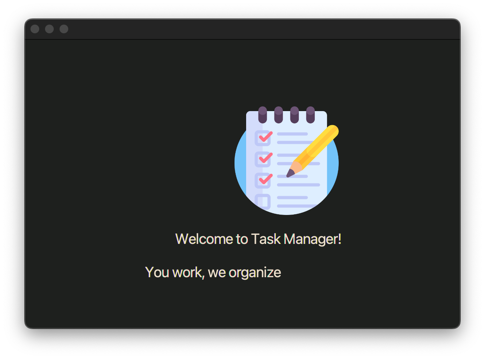

### Project goals
- develop basic understanding of spring framework(dependency injection, hibernate date persistence etc) and learn what to take to consideration when designing future projects <- achieved
- practice java language in more complex applications <- achieved
- practise JavaFX framework <- achieved

### Additional lessons learned: 
- database schame must be well designed from start, changing it later down the line is really hard and troublesome
- Hibernate data persistance is useful, but sometimes it is tricky
  - in case of my project i did wanted to lazy load user's task manager to get only users to show on the login screen. Later when i loaded tasks for particular user, new instance of task manager would be loaded and i was problematic

### Current state of project 
 - I considered this project finished. I may not be production ready, but i have achieved all my goals and i got most important thing from it - experience. Developing this project further would be mostly about visual aspects of it, so it would not be, as beneficial for me, as transitioning to more up to date applications, like designing webapps

### Usage
 - create a mysql database on port 3306
 - use database_starter to initialize database schema
 - update application.properties file to mach your database login data
 - build maven project and run the main method in Main class 

### Result 

[video](realisation_results/demo_video.mov)
### Attributions
- "list.png" <- <a href="https://www.flaticon.com/free-icons/to-do-list" title="to do list icons">To do list icons created by Freepik - Flaticon</a>
- "chart-histogram.png" Uicons by <a href="https://www.flaticon.com/uicons">Flaticon</a>
- "home.png" Uicons by <a href="https://www.flaticon.com/uicons">Flaticon</a>
- "list.png" Uicons by <a href="https://www.flaticon.com/uicons">Flaticon</a>
- "settings.png" Uicons by <a href="https://www.flaticon.com/uicons">Flaticon</a>
- "user.png" Uicons by <a href="https://www.flaticon.com/uicons">Flaticon</a>
- "users.png" Uicons by <a href="https://www.flaticon.com/uicons">Flaticon</a>
- "add.png" Uicons by <a href="https://www.flaticon.com/uicons">Flaticon</a>
- colour combination <- <a href="https://colorhunt.co/palette/1e201e3c3d37697565ecdfcc" title="colour">colorhunt.co</a>